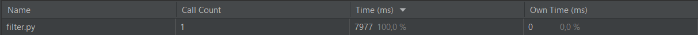

# PythonInstruments
Задание по теме Инструментарий Разработчика в Питоне

## Результаты

### Изначальная картинка

### Моя версия filter.py с вводом пользователя

### Моя версия filter.py без ввода пользователем

### Оригинальный filter.py

---

## Профилирование

### Моя версия filter.py с вводом пользователя

### Моя версия filter.py без ввода пользователем

### Оригинальный filter.py

---

Версия с пользовательским вводом, очевидно, самая медленная.
Это из-за того, что ввод занимает очень много времени, компьютер
исполняет всё гораздо быстрее человека.

Моя версия без ввода быстрее оригинальной более чем в 10 раз.\
Это можно объяснить тем, что в моей версии 
гораздо меньше вызовов. И вызовы в новой версии -
это преобразования через NumPy, которые быстрее
циклов в Python.
